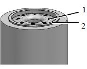

# Фильтр грубой очистки топлива «CF»

На автомобилях, укомплектованных двигателями Cummins ISB, устанавливается ФГОТ ф. «СF» (CUMMINS FILTRАTION») (см. рис. Фильтр грубой очистки топлива ф. «СF»).

Фильтр грубой очистки топлива ф. «СF»

1 – фильтр-патрон; 2 – крышка фильтра; 3 – пробка; 4 – топливопрокачивающий насос; 5 – подогреватель; 6 – сливной кран; 7 - датчик наличия воды

Прокачку системы питания топливом с помощью топливопрокачивающего насоса (выпуск воздуха) необходимо производить при замене сменного фильтра или выполнении работ на линии подачи топлива. Для выпуска воздуха необходимо (см. рис. Выпуск воздуха насосом предпусковой прокачки топлива):
 - отвернуть пробку 1;
 - отвернуть рукоятку ручного топливопрокачивающего насоса 2. Откачивать воздух топливопрокачивающим насосом до тех пор, пока из отверстия не пойдет топливо;
 - затянуть пробку 1 моментом 15 Нм;
 - затянуть рукоятку ручного топливопрокачивающего насоса.

Выпуск воздуха насосом предпусковой прокачки топлива

1 - пробка; 2 – топливопрокачивающий насос

# Слив воды из фильтра
При наличии воды в фильтре на дисплее в комбинации приборов высвечиваются коды SPN - 97 и FMI - 15. Необходимо выключить двигатель и слить воду из фильтра через сливной кран, расположенный в днище фильтра.

### **Внимание!**

Перед сливом смеси воды и топлива из водосборного стакана, а также перед прокачкой системы питания топливом с помощью топливопрокачивающего насоса, необходимо подставить под ФГОТ емкость для cбора смеси воды и топлива.
Не допускать попадания топлива на агрегаты автомобиля и землю.

Для замены фильтра:

 - отсоединить жгут проводов датчика наличия воды от фильтра;
 - очистить головку фильтра и сам фильтр;
 - слить топливо из фильтра, отвернув сливной кран;
 - вывернуть фильтр с помощью ленточного ключа;
 - заполнить новый фильтр топливом, подавая его через небольшие отверстия 1 вокруг резьбы фильтра (см. рис. Фильтр-патрон);
 - очистить поверхность головки фильтра, контактирующую с прокладкой фильтра 2;
 - нанести на прокладку фильтра слой масла;
 - завернуть фильтр вручную так, чтобы его головка коснулась прокладки фильтра;
 - затянуть фильтр от руки на ¾ - 1 оборот;
 - подсоединить жгут проводов датчика наличия воды к фильтру;
 - удалить воздух из системы с помощью топливопрокачивающего насоса.

### **Внимание!**
Монтажные работы выполнять только при отключенном двигателе.
Насос предпусковой прокачки топлива не демонтировать.

Фильтр-патрон

1 – отверстия для подачи топлива; 2 – прокладка фильтра