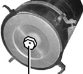

# Замена воздушного фильтра

## При загорании на панели приборов контрольной лампы засоренности воздушного фильтра   , необходимо заменить фильтроэлемент.

### 1. Откинуть защелку крепления крышки воздушного фильтра, снять крышку (см. рис. Крышка воздушного фильтра).

Крышка воздушного фильтра

1, 2, 3 - защелка; 4 - крышка.

### 2. Открутить гайку-барашек.

Гайка-барашек

### 3. Извлечь основной фильтрующий элемент 5 из корпуса фильтра 1 (см. рис. Замена основного фильтрующего элемента).

Замена основного фильтрующего элемента

1 - корпус фильтра 2 - элемент безопасности; 3 - шайба; 4 - гайка; 5 - основной фильтрующий элемент

### 4. Гаечным ключом проверить момент затяжки гайки 4 на стержне, фиксирующей элемент безопасности 2. Момент затяжки должен быть от 0,7 до 1,0 кгс·м.
   При недостаточном моменте затяжки гайки 4 не обеспечивается надежное уплотнение элемента безопасности 2 с корпусом воздушного фильтра 1, что может привести к попаданию неочищенного воздуха в двигатель.

### 5. Установить новый основной фильтрующий элемент.

### 6. Закрепить основной фильтрующий элемент, закрутив гайку-барашек от руки;

### 7. Установить крышку на корпус воздушного фильтра. При этом стрелку, изображенную на крышке, расположить вертикально вверх.

### 8. Застегнуть защелки на крышке воздушного фильтра.

# Замена элемента безопасности

## После трехкратной замены основного фильтрующего элемента, а также, если при малом пробеге после замены основного фильтрующего элемента вновь срабатывает индикатор засоренности воздушного фильтра, необходимо заменить элемент безопасности. Для этого:

 - проделать операции, описанные в п. 1-3 (см. выше);
 - гаечным ключом открутить гайку на стержне, фиксирующую элемент безопасности;
 - извлечь элемент безопасности;

Во время замены элемента безопасности следует избегать попадания неочищенного воздуха во впускной тракт двигателя, например вследствие неблагоприятных погодных условий (задувание ветром).

 - влажной мягкой тряпкой качественно протереть внутреннюю полость воздушного фильтра;
 - заменить элемент безопасности на новый;
 - установить шайбу и гайку. Затянуть гайку моментом от 0,7 до 1,0 кгс·м.
 - далее собирать согласно п. 5-8 (см. выше).

Применять фильтроэлементы производителей, имеющих официальное заключение НТЦ ПАО «КАМАЗ» на поставку.

В отдельных комплектациях автомобилей применяется воздушный фильтр ф. MANN+HUMMEL.
Сведения по техническому обслуживанию воздушного фильтра (копия Руководства) приведены в приложении «MANN+HUMMEL Europiclon® серия 45 Руководство по техническому обслуживанию воздушного фильтра».

 

